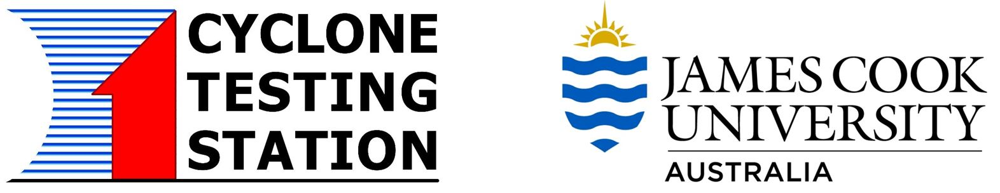
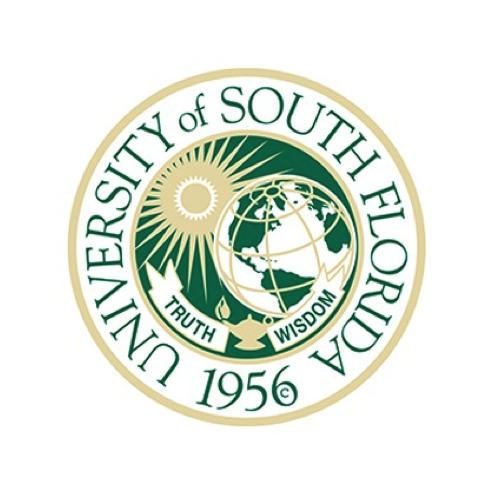

## Our Partners

### Funding Partners

This project is funded through generous support of the following sponsors:
- UCAR President's Strategic Initiative Fund FY2019 Research Award ($120,000)
- Research Applications Laboratory FY2017 Opportunity Fund ($29,241) and lab co-sponsorship ($13,000)
- The COMET Program co-sponsorship ($2,337)

### Government Partners

Many government agencies as well as state and local governments have a strong interest in improving public safety. The following government agency is partnering with us by having one of their program directors serve as a point of contact in our Researcher Collective. 

- National Institute of Technology - National Windstorm Impact Reduction Program (NIST/NWIRP)

### University Partners

A large number of universities are represented by their experts who are participating in the project's Researcher Collective. Here are some of our university partners.

| James Cook University - Cyclone Testing Station (Australia) |  |
| University of Florida |  | 
| Stanford University | |
| Auburn University |  | 
| Massachussetts Institute of Technology |  |
| Colorado State University |  |
| University of South Florida |  |
| New York University | |
| Florida International University | |
| University of Washington | |
| Massey University (New Zealand) |  |
| Monash University (Australia) |  |
| University of Queensland (Australia) | |

[Next: Project Schedule](schedule.html)

