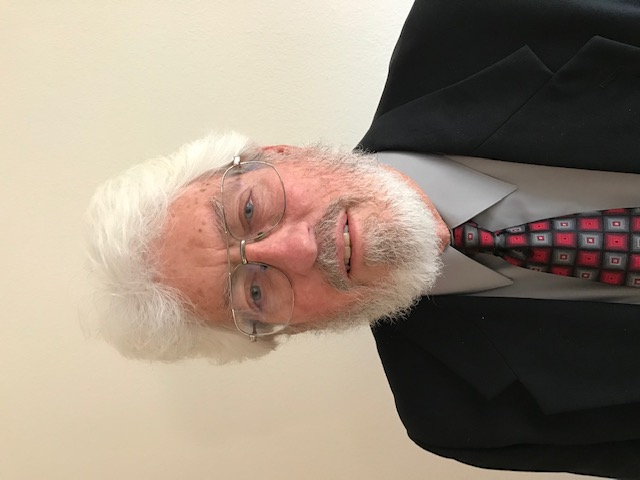

## Our Team

### Project Lead and Principal Investigator

#### Jonathan Vigh

### Project Co-Principal Investigators

#### Daniel Smith

#### David Hahn

#### Paul Kucera

### Project Collaborators and Advisors

#### Alan Bol

#### Alexis Merdjanoff

#### Barbara Brown

#### Bruce Ellingwood

#### Cao Wang

####  Christian Mario Appendini Albrechtsen

Dr. Christian Mario Appendini Albrechtsen is a professor at the Universidad Nacional Autónoma de México, Instituto de Ingeniería, Laboratorio de Ingenieria y Procesos Costeros (Laboratory of Engineering and Coastal Processes). Dr. Appendini has expertise in wave modeling and coastal transport. Among other things, his research involves modeling waves from tropical cyclones under climate change to set appropriate design criteria for offshore structures such as oil rigs and wind turbines. Dr. Appendini will be a key point of contact for expanding and adapting the HurricaneRiskCalculator for Mexico.

#### Christopher Kuhlman

#### Christopher Rozoff

#### David Prevatt

#### David Roueche

#### Elisabeth Holland

#### Eric Hendricks

#### Fernando Tormas-Aponte

Dr. Fernando Tormos-Aponte is Assistant Professor of Public Policy and Political Science at the University of Maryland - Baltimore County, with specializations in social movements, the politics of social groups, and social change. Dr. Tormos-Aponte has recently been selected to be a Faculty Innovator in the NCAR Early Career Faculty Innovator Program. His project will focus on vulnerability related to tropical cyclone-related power outages and equitable strategies for power restoration. He will be a key collaborator in adapting HurricaneRiskCalculator for Puerto Rico.

#### Gabrielle Wong-Parodi

#### Geeta Nain

#### Helen Greatrix

Dr. Helen Greatrex is an Assistant Professor in Geography and Statistics at the Pennsylvania State University and a co-hire of the Institute for Computational and Data Sciences. Her research focuses on taking a mixed methods approach to weather vulnerability modelling, along with assessing how remotely sensed weather products can support the weather risk management industry. She is also a member of the WMO Social and Economic Applications Working Group (SERA). Dr. Greatrex will be participating in the Social Science Team. 

#### James Done

#### Jane Rovins

#### Josh Alland

#### Jennifer Collins

#### Jonathan Lin

#### Kerry Emanuel

#### Laura Myers

Dr. Laura Myers is a Senior Research Scientist and Director of the Center for Advanced Public Safety. Dr. Myers joined The University of Alabama and the Center for Advanced Public Safety in 2013 having previously served as research faculty at Mississippi State University, Clemson University and Sam Houston State University. She has extensive experience in emergency management and criminal justice research. Dr. Myers will be participating in the Social Science Team. 

#### Melissa Moulton

Dr. Melissa Moulton is a Project Scientist in the Oceanography Section of the Climate and Global Dynamics Division. She received a Ph.D. in Physical Oceanography in the MIT-WHOI Joint Program in 2016. Using coupled hydrologic and ocean models and field observations, Moulton is investigating the dispersal of contaminants and freshwater during extreme flooding events under changing climate and land use. Other interests include surface waves, nearshore processes, extreme events reconnaissance, cross-shelf exchange, larval transport, coastal water quality, and coupled human-natural systems.

#### Michael (Mike) Baldwin

Dr. Michael Baldwin is Associate Professor at the Department of Earth, Atmospheric, and Planetary Sciences, Purdue University. He has a B.S.E. degree in Atmospheric Science from the University of Michigan and a MSci and PhD degrees in Meteorology from the University of Oklahoma. He has research interests in numerical weather prediction, forecast verification, data assimilation, data mining. Dr. Baldwin has extensive experience in verification and joins the Verification Team of the Researcher Collective. His graduate student, Geeta Nain, is undertaking verification of the probabilistic forecasts of pointwise wind speed. 

#### Pallab Mozumder

#### Rick Luettich

Dr. Rick Luettich has an undergraduate and master’s degree in civil engineering from Georgia Tech and a doctor of science in civil engineering from MIT. He serves as the Director of UNC’s Institute of Marine Science, which is comprised of approximately 75 residential faculty, staff and students located on the coast in Morehead City, North Carolina. He also serves as the Director of the UNC Center for Natural Hazards Resilience and is the lead-PI on the Department of Homeland Security Coastal Resilience Center of Excellence and on the US Integrated Coastal Ocean Observing Systems (IOOS)Coastal and Ocean Modeling Testbed. He is one of the principal developers of the ADCIRC coastal circulation and storm surge model and has overseen applications ranging from interdisciplinary studies of physically mediated migration, larval dispersal and water quality, to coastal hazard delineation to hindcasts and forecasts of tides and storm surge/inundation along the US coast. ADCIRC has been a cornerstone of US Army Corps of Engineers and FEMA storm surge studies that include forensic studies in the aftermath of Hurricanes Katrina and Rita, planning studies for new hurricane protection systems for the Northern Gulf of Mexico coastline and coastal flood risk studies along the Gulf of Mexico and US East Coast for the FEMA National Flood Insurance Program. It is also being used in pilot storm surge forecasting projects. Luettich has served on three recent National Academy/National Research Council committees – one reviewing the factors that led to the catastrophic damage to New Orleans by Hurricane Katrina, the second reviewing the options for a new hurricane protection system for Southern Louisiana and chairing a third committee on Reducing Coastal Risk. He has also actively participated on numerous other advisory committees / governing bodies including the Southeast Louisiana Flood Protection Authority-East; the Science and Engineering Advisory Council for the Water Institute of the Gulf; and as a publicly elected member of the Carteret County Board of Education. He joins the Researcher Collective’s newly formed Storm Surge Team.

#### Robert (Bob) Goldhammer

Mr. Robert Goldhammer has been involved in Emergency Management since the early 1990s, serving in the Tampa Bay area as Assistant Chief of Operations with Hillsborough County Emergency Medical Service and as the EMA Director for Polk County, Iowa. He has degrees in Meteorology (B.S., 1974), Business Management (B.S., University of South Florida, 1995), and Teachers in Geosciences (Masters, Mississippi State University, 2002). He received his Certification as an Emergency Manager (CEM) from the International Association of Emergency Managers (1994) and Certified Business Continuity Professional (CBCP) certification from the Disaster Recovery Institute International (1999). Bob served as a regional president of the International Association of Emergency Managers for approximately 10 years. He currently represents the organization as liaison to the National Weather Service (NWS) Weather Ready Nation program and the World Meteorological Organization’s global Weather Ready Nations program. He is a member of the FEMA National Reservist Program where he serves with the Hurricane Liaison Team. He was the co-chair of the American Meteorological Society (AMS) Emergency Management Committee from its inception to January 2017. He is currently a member of the instructor cadre for the National Disaster Preparedness Training Center, is a member of the HiWeather Communications workgroup, and is also a member of an ASCE-NWS workgroup that is updating the EF Tornado Intensity Scale based on engineering studies of buildings and other structures impacted by high winds. He will be participating in the project’s Emergency Management team to build connections between this effort and the Emergency Management community. 

#### Scott Weaver

#### Stephanie Pilkington

#### Susan Joslyn

#### Taylor Asher

Mr. Taylor Asher is a PhD student at the Coastal Circulation and Hazards Research Group located at the Institute of Marine Sciences (IMS), an off-campus research unit of the University of North Carolina at Chapel Hill that is located on the central North Carolina coast. This group, led by Dr. Rick Luettich, is actively involved in modeling and observational studies of physically driven processes in coastal / estuarine waters and in the hazards that result when coastal / estuarine waters respond to severe weather events. Taylor has developed a computationally fast approach to probabilistic prediction of storm surge using surrogates of the ADCIRC coastal circulation and storm surge model. He joins the Researcher Collective’s newly formed Storm Surge Team.

#### Thomas Kloetzke

#### Tsvetomir Ross-Lazarov

#### Y. Peter Sheng

[Next: Our Partners](partners.html)

